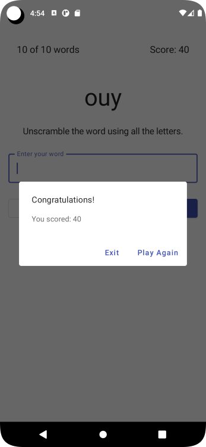

# Unscramble App - Compose

## App Description
Single player game app that displays scrambled words. To play the game, player has to make a
word using all the letters in the displayed scrambled word.
This code demonstrates the Android Architecture component- ViewModel and StateFlow.

## Codelab from developer.android
* **Codelab: 5) ViewModel and State in Compose**
    * This is a Walk through Codelab
* **Codelab: 6) Write unit tests to test the ViewModel**
    * This is a Walk through Codelab

## Solution in github
* Codelab: 5) Branch viewmodel
    * https://github.com/google-developer-training/basic-android-kotlin-compose-training-unscramble/tree/viewmodel
* Codelab: 6) Branch main
    * https://github.com/google-developer-training/basic-android-kotlin-compose-training-unscramble

## Objective
* Learn how to use a ViewModel, Implement a ViewModel to retain the app state during configuration changes.
* Learn how to test the ViewModel to verify the correctness, functional behavior, and usability of your app.

## Notes
* Used viewmodel
* Create Tests

## ANDROID BASICS WITH COMPOSE - Unit 4:  Navigation and app architecture - Pathway 1: Architecture Components
Link: https://developer.android.com/courses/pathways/android-basics-compose-unit-4-pathway-1

## Codelab Screenshot

  
  
  

ref: unscramble-app-android-kotlin-compose

#appunscramble #viewmodel
#codelab
